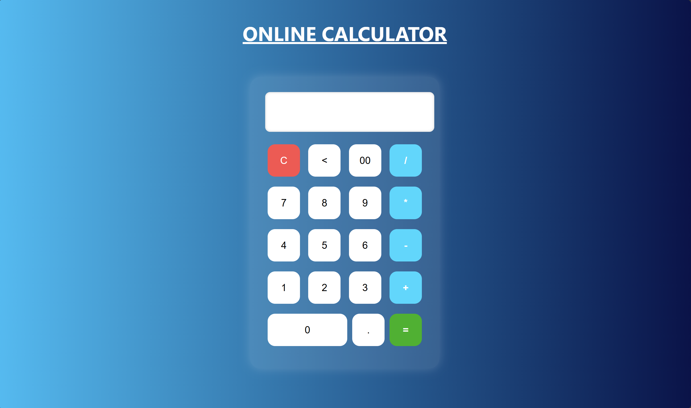

# 🧮 Basic Calculator (HTML + CSS + JavaScript)

This is a simple, responsive **Online Calculator** web application built using **HTML**, **CSS**, and **Vanilla JavaScript**. It supports basic arithmetic operations like addition, subtraction, multiplication, and division.

---

## 📸 Preview

 

---

## 🚀 Features

- Clean and responsive UI
- Click-based number and operator input
- Clear (`C`), Backspace (`<`), Decimal (`.`), and `00` input
- Real-time expression display
- Calculates result using built-in JavaScript `eval()` *(not recommended for production)*

---

## 🔧 Tech Stack

| Technology | Purpose        |
|------------|----------------|
| HTML       | Markup         |
| CSS        | Styling & Layout |
| JavaScript | Calculator Logic |

---

## 📂 File Structure

calculator-project/
│
├── index.html # Main HTML file
├── calculator.css # Styling (linked in HTML)
└── README.md # Project documentation

🙋‍♂️ Author
Y Manoj Kumar